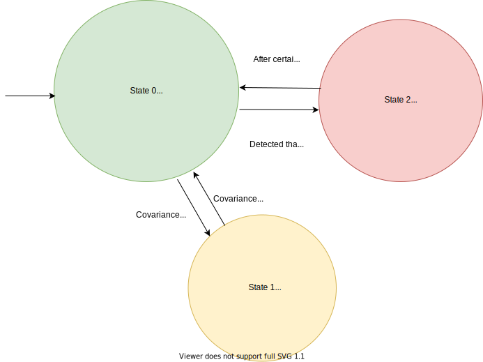
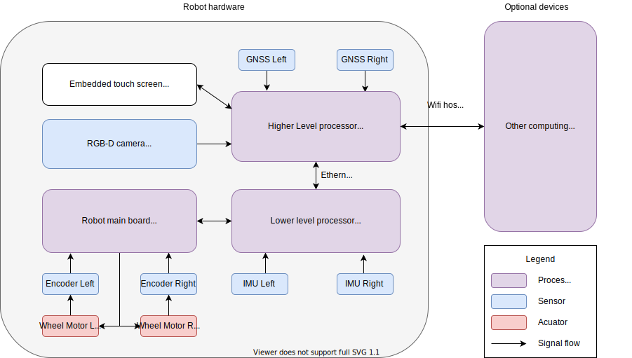
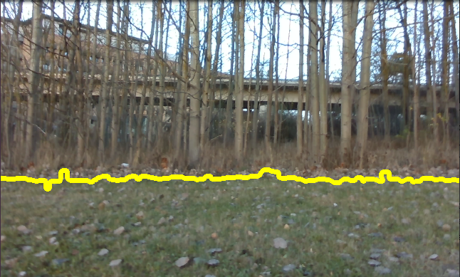

Boundary Guard for Field Robot 
======
**_(Finishing soon but still under construction.)_**

## Contents

- [Overview](#Overview)
- [Installation](#Installation)
- [Launch](#Launch)
- [Documentation](#Documentation)
- [License](#License)
<!-- - [API documentation](#API-documentation) -->
<!-- - [Read more](##Read-more) -->


## Overview
<a name="Overview"></a>

This project is designed for Huqvarna automower 450x as a trial to replace the underlaid wire boundary. The repository is based on , however has added a localization module and a visual boundary detector, upon additional two IMU, two GNSS and one Intel Realsense D435 depth camera. 

The localization function is considered an active approach to limit the robot within its operation area. It applies Kalman filters to fuse the sensors' outputs and can integrate with the estimated pose from the visual SLAM node. Visual boundary detector to the contrary is considered to be a more passive method to bound the area. It is based on image segmentation via explicit image processing pipelines, that is, no heavy learning method is applied, for convience and computational effiency. 

The software is designed under Ubuntu 16.04 and ROS Kinetic. The software architecture is shown below in a conceptual but not strict state machine(not implemented in this project):




The hardware setup in this project can be abstracted in the diagram below:




## Installation
<a name="Installation"></a>


Necessary packages for the sensors in Gazebo: 
`ros-kinetic-hector-gazebo-pluginss` and `ros-kinetic-geographic-msgs`


## Launch
<a name="Launch"></a>

In order for testing, we seperate the functions into different launch files, which can be combined in one overall launch if desired.

### On physical hardware

Launch files   | Functions
-------------- | -------
`roslaunch am_driver_safe automower_hrp.launch`	| Launch the robot
`roslaunch am_sensors sensors.launch`          	| Launch the added sensors
`rosrun am_driver hrp_teleop.py`            	| Control via keyboard
`roslaunch am_driver_safe ekf_template.launch`  | Launch localization
`./am_vision/scripts/boundary_detect.py`        | Run the boundary detect node (may link to ROS later)
`roslaunch am_sensors rtabmap.launch`           | Launch visual-SLAM
`roslaunch am_driver path_follow`				| Run the path follower

Examplary results (you should take it with a pinch of salt):


### In simulation
Althought not heavily used in this projected, the simulation in Gazebo provides models of the robot and sensors. Two lawn settings are also available in `simulation/am_gazebo/worlds`. In order to launch: 
```
roslaunch am_gazebo am_gazebo_hrp.launch gui:=true
```
The robot in simulation also receives control input via the topic `/cmd/vel`, so `hrp_teleop.py` can be severing here.


## Documentation
<a name="Documentation"></a>

The documentation and miscellanea are available at the project's .


## License
<a name="License"></a>

This repository is under the open source MIT License. 
