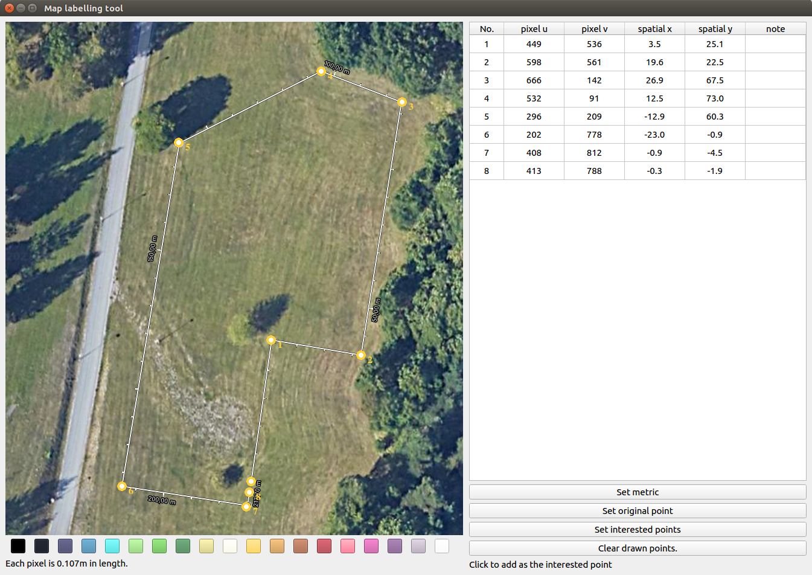
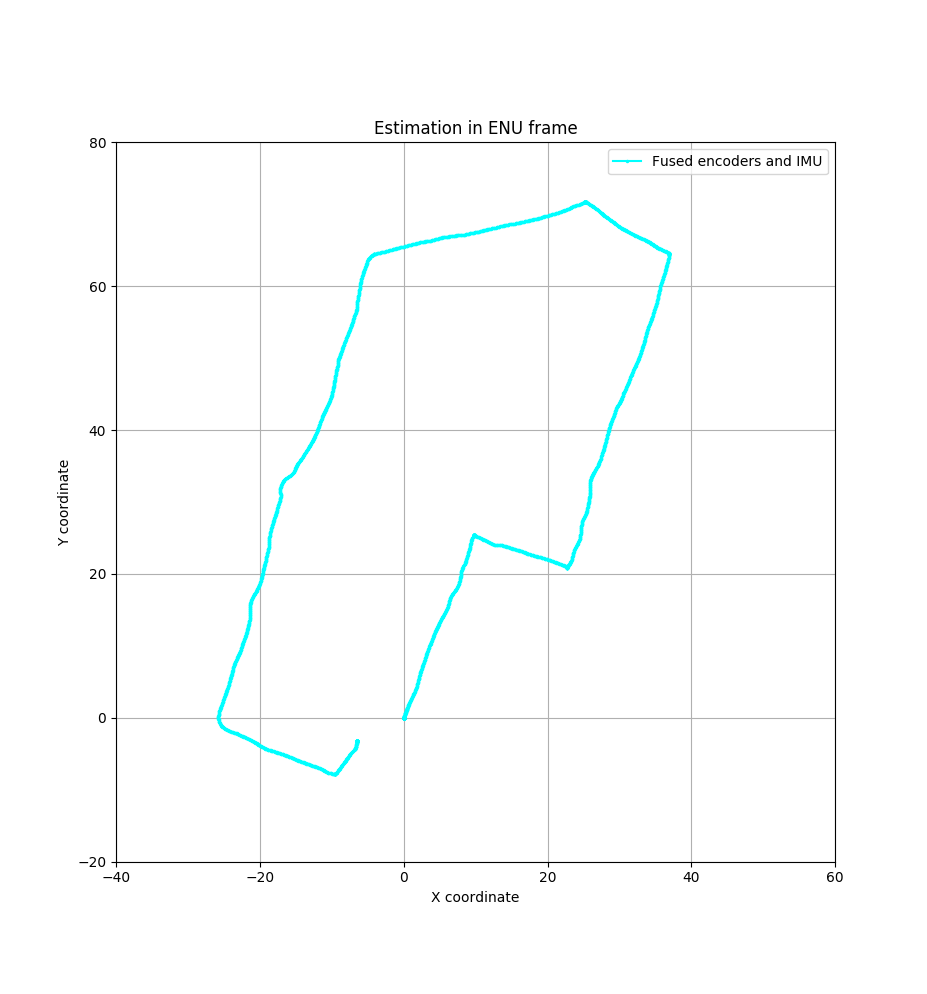
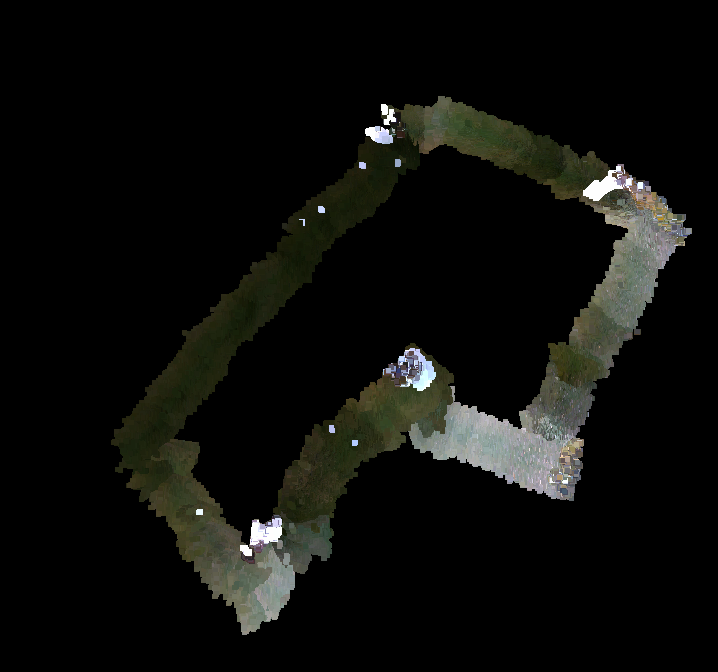
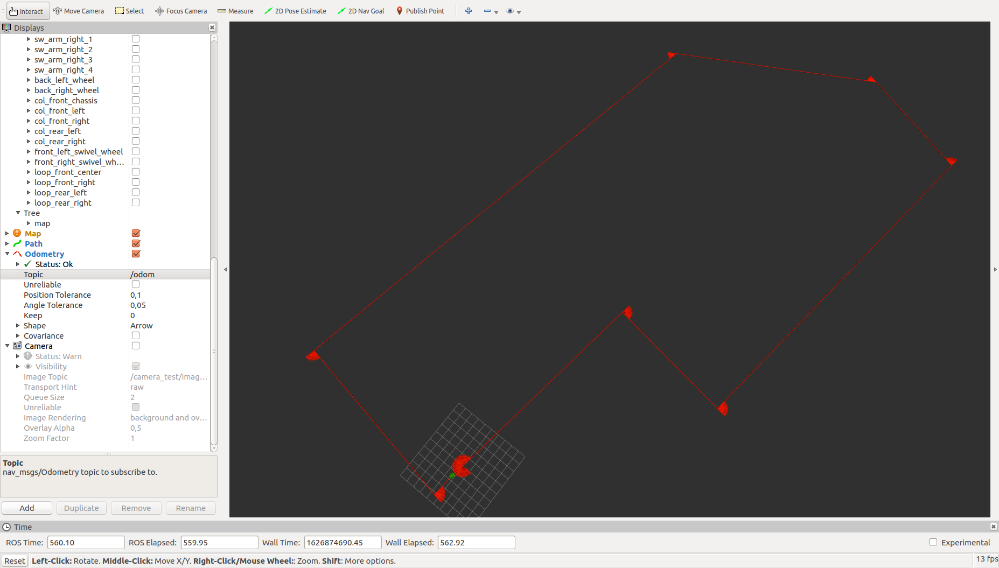

Boundary Guard for Field Robot 
======
<!-- **_(Finishing soon but still under construction.)_** -->


## Contents

- [Overview](#Overview)
- [Dependency and installation](#Installation)
- [Launch](#Launch)
- [Documentation](#Documentation)
- [License](#License)
<!-- - [API documentation](#API-documentation) -->
<!-- - [Read more](##Read-more) -->


## Overview
<a name="Overview"></a>

This project is designed for Huqvarna automower 450x as a trial to replace the underlaid wire boundary. The repository is based on , and has added a localization module and a visual boundary detector, upon additional two IMU, two GNSS and one Intel Realsense D435 depth camera. 

The localization function is considered as an active approach that applies Kalman filters to fuse the sensors' outputs and can integrate with the estimated pose from the visual SLAM node. Visual boundary detector then is a more passive method based on image segmentation via explicit image processing pipelines, that is, no heavy learning method is applied, for convenience and computational effiency. 

The software is designed under Ubuntu 16.04 and ROS Kinetic. 

<table>
  <tbody>
  <tr>
    <td width="50%"></td>
    <td width="50%"></td>
  </tr>    
  <tr>
    <td>The software setup in a conceptual proposed state machine(not implemented in this project)</td>
    <td>The hardware setup</td>
  </tr> 
  </tbody>
</table>


## Dependency and installation
<a name="Installation"></a>

Due to the multiple hectorgeneous sensors we choose, and the customized changes in depent packages, the installation steps are prolonged and shown in a seperate [installation page](https://github.com/TianzeLi/hrp_myversion/wiki/Installation) in the repository wiki. 


## Launch
<a name="Launch"></a>

In order for testing, we seperate the functions into different launch files, which can be combined in one overall launch if desired.

### On physical hardware

Launch files   | Functions
-------------- | -------
`roslaunch am_driver_safe automower_hrp.launch`	| Launch the robot
`roslaunch am_sensors sensors.launch`          	| Launch the added sensors
`rosrun am_driver hrp_teleop.py`            	| Control via keyboard
`roslaunch am_driver_safe ekf_template.launch`  | Launch localization
`python am_vision/scripts/boundary_detect.py`   | Run the boundary detect node (may link to ROS later)
`roslaunch am_sensors rtabmap.launch`           | Launch visual-SLAM
`roslaunch am_driver path_follow.launch`		| Run the path follower

Using the GUI in `test/scripts/map_measure.py`, we can calculate the positions of the interested points on the map:



Localization results for example: 

<table>
  <tbody>
  <tr>
    <td width="50%"></td>
    <td width="50%"></td>
  </tr>    
  <tr>
    <td>EKF localizaton without vision</td>
    <td> Visual SLAM result based on rtabmap</td>
  </tr> 
  </tbody>
</table>


Visual boundary detection results for example:

<table>
  <tbody>
  <tr>
    <td width="50%"></td>
    <td width="50%"></td>
  </tr>    
  <tr>
    <td>With Intel Realsense D435 camera</td>
    <td>With iPhone 7 camera</td>
  </tr> 
  </tbody>
</table>


Path follower in Gazebo for example: 




### In simulation
Althought not heavily used in this project, the simulation in Gazebo provides models of the robot and sensors. Two lawn settings are also available in `simulation/am_gazebo/worlds`. In order to launch: 
```
roslaunch am_gazebo am_gazebo_hrp.launch gui:=true
```
The robot in simulation also receives control input via the topic `/cmd/vel`, so `hrp_teleop.py` works here too.


## Documentation
<a name="Documentation"></a>

The documentation and miscellanea are available at the project's .


## License
<a name="License"></a>

This repository is under the open source MIT License. 
